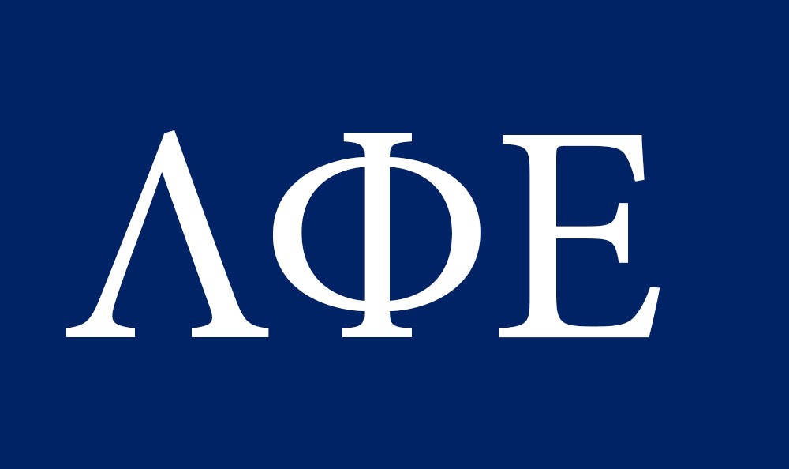
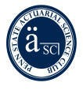

# 学术攻略篇

## 教材购买攻略

### 如何确定教材？

1. 一般来讲要两种方式结合去做。通常，开学前，教授会向每个他课程下的学生发送一封e-mail\(说说自己的经历，规矩，要求 zzzzzzzz, 最后一般会将关于教材的要求\)。有的时候，有些好教授会提供给学生电子图书下载链接，或者告诉大家其实书不用买也行。这时勤查e-mail 这个好习惯的重要性就体现出来了。案例一，小编自己，EE 以及 CMPSC 课程，由于没看邮件去买了书，结果一学期没看过！都是白花花的银子呀！心在滴血呀！（此处受到一万点伤害）。
2. 言归正传，官方的方法确定教材是登陆 LionPath 网站，找到 schedule 中的 student schedule，选择一个 semester \(一般新生都是什么 fall\), format 里点 course detail, 之后在buy book 下面打勾，点 confirm selected books， 之后点submit to Penn State Book Store，就可以看到所有所需图书了。

### 如何购买与租借？

#### 一般来讲分为三种：

1. **实体店**    所谓实体店，就是学校的 bookstore。在 Penn State 一共有两个主要的bookstore, 分别位于hub \(学生活动中心\)和downtown \(大碗公饭店旁边,W College Ave 上\)。 图书馆的书一般来讲比较全，如果你是土豪并且闲麻烦的话，图书馆购书是不二选择。（真的真的真的很贵，美国的教课书简直贵到丧心病况，但是少数情况下一些比较抢手的课，必要求图书也会出现断货情况。）同时，也可以租借图书，价格一般是购买价的一半不到，过程很简单，拿上你的student id 填个小纸片，交钱！完事！记得工作人员提醒大家的还书日期，学期结束后还晚了可是有late fee 的。
2. **网上租赁与购买**    一般来讲网上购书优点是价钱真的比bookstore便宜很多通常为bookstore的1/2还不到，但是缺点就是质量不好把控，邮寄速度不理想。此外，网上教科书还会有international edition, 价格会相对更便宜，就是内容稍微有所改动，而且纸张可能没有原版图书的好，但是跟我大天朝比也是好得多了！  [Amazon](https://github.com/v1siuol/psucusa.gitbook.io/tree/a60ef445cab91e59479273f7b8ba686fdd7460e4/docs/www.amazon.com)  [Chegg](https://github.com/v1siuol/psucusa.gitbook.io/tree/a60ef445cab91e59479273f7b8ba686fdd7460e4/docs/www.chegg.com)  [Taobao](https://github.com/v1siuol/psucusa.gitbook.io/tree/a60ef445cab91e59479273f7b8ba686fdd7460e4/docs/www.taobao.com)
3. **电子书**    如果你是想买电子书，小编还是奉劝一句，三思而行，因为纸质的教科书还是更加的直观一些。但是，嘿嘿，你们这些小心思，小编都懂！下面福利继续放送：    小编来教各位如何在美帝下载电子书
   * 一般来讲，大家可以输入书的名字 加 :pdf 在搜索引擎中，之后的过程就不一一详述了，就是一个个筛查，看有没有match的。要是没有，ok 进入下一步骤。
   * 求学长学姐share资源，还不行怎么办，再求，还不行，跪求，还不行，……你懂的！哈哈！一般来讲学长学姐哪家强？CUSA 学长学姐胜蓝翔……没加群的各位学弟学妹，赶紧进群。群里只有你们想不到的！
   * 最后，其实我们学校的图书馆是提供图书外借的，但是只能借出2个小时，所以如果大家有临时需求的话，还是可以考虑这个不错的选择。尤其是那些爱美的妹子们，把沉重的教科书放家里，去图书馆借阅一定会成为你们的习惯的！

## 选课指南

### General Education

GE, 在美国大学的教育系统当中，大部分的学校将课程程划为两个部分，分别为General Education 和专业课。大部分的专业总学分达到120分即可毕业，但一些工程类专业，例如Electrical Engineering 等 就需要总学分达到130 分方可毕业。由于大部分的专业课难度通常比较大，所以在大一大二，如果能巧妙的通过一些选课技巧合理规划课程安排，不仅可以提高整体GPA, 而且还能让大家在四年的大学生活中更好的完成学业目标顺利毕业。下面就让小编首先为大家介绍一下Penn State 的General Education 板块：



| Skills | Credits |
| :--- | :--- |
| Writing Speaking \(GWS\) | 9 Credits |
| Qualification \(GQ\) | 6 Credits |
| Total | 15 Credits |



| Additional Requirements | Credits |
| :--- | :--- |
| First Year Engagement Program  \(First Year Seminar\) | may vary |
| United States Culture \( US \) | 3 Credits |
| International Culture \( IL \) | 3 Credits |
| Writing Across the Curriculum  \(W,M,X,Y\) | 3 Credits |



| Knowledge Domains | Credits |
| :--- | :--- |
| Health and Physical Activities \(GHA\) | 3 Credits |
| Natural Science \(GN\) | 9 Credits |
| Arts \(GA\) | 6 Credits |
| Humanities \(GH\) | 6 Credits |
| Social and Behavioral Science \(GS\) | 6 Credits |
| Total | 30 Credits |



  下面小编可以激动的告诉大家一个好消息，当各位把上方表格内所有的 requirements 都修满足了的话！的话！的话！ 你———就可以“小毕业”一下了。因为在美国，Penn State 会提供一个两年的学位证书，但是这是有区别于四年制的学士学位，完成 General Education 部分就会获得由学校颁发的叫做 Baccalaureate Degree。但是，想拿学士学位！前方还有漫长而又艰苦的专业课以及相关专业选修课等着大家。至于这一块，由于专业差异性太大，小编就不一一解释。总之，每当到考试周，Penn State 的校友之间都会流传着这样一句话，“只要专业选的好，考试天天像高考！”，“May the force be with you, 别太放肆没啥用！”。小编这里给大家开个玩笑。言归正传，关于未来其它每个专业的选课要求，各位新生们可以去 LionPath 下属的 degree audit 中去详细查看。


**其它注意事项：**  
 &gt;  每一名国际学生都需要上一节ESL 015, 一节CAS 100 和一节ENGL 202 相关课程。  
 &gt;  GA, GH, GS 课程总共18学分，但是penn state 并不要求每门一定要上两节课，就是6学分（通常AHS 课程每节三分），如果你觉得这三类课程里你更擅长哪一项，你就去多上这类的课程。但是，要保证每个类别的课程至少上一节课。就小编而言，我建议大家少上GH 下属的课程，因为难度真不是盖的，GPA是真往下拽的！！！  
 &gt;  Double Major 的情况下General Education 是不需要再修一遍的，只需要完成相关交叉专业课程就好。  
 &gt;  考虑到大家可能会懒到不想见advisor，毕竟约他们太难！小编建议大家去google 搜 “psu recommend course” 中第一个链接进入里面搜寻自己的专业相关推荐学期课程安排规划进行选课，如果还有疑问，小编还是建议大家抬起双腿，勉强的去见一下advisor叔叔阿姨们！毕竟，课程的安排还是在大学学术生活中不可小觑的重要环节。未来，大家还会慢慢学会凌晨爬起来抢课的过程，因为你们刚入学不存在这个问题，小编就不在这里详述啦！


### 水课推荐

水课其实是一个很相对的概念。小明觉得很简单的课，小红或许上得很吃力，而小红随随便便拿了A的课，小明说不定拼死老命只能勉强拿个C。所以在这里，小编给大家推荐的都是广受好评，精挑细选，十多年广大中国留学生薪火相传，几乎不受智商、专业和偏科限制的大水课，希望小编的推荐对大家有一定的帮助！




| 课程编号 | 介绍 |
| :---: | --- |
| MUSIC 004 | 电影音乐赏析，可以跟以前的学长学姐咨询详情 |
| MUSIC 007 | 爵士乐发展史，也是有题库，还有一篇作文，但是随便写都是A，但切记一定要上网课，实体课并不水！ |
| MUSIC 008 | 基础音乐理论，虽然没有题库，但是真的太简单了，没有音乐基础也不碍事。实体课有作曲project，但是评分标准并不严苛，不需要紧张。 |
| MUSIC 011 | 古典音乐原理，也是可以跟学姐学长咨询详情的 |
| MUSIC 054 | 入门吉他，但是很难抢，低年级基本上不用想了 |
| ART 020 | 绘画入门，基本上只要让老师看到你有进步就能A，不需要绘画基础 |
| ART 030 | 雕塑入门，同上，推荐实体课 |
| ART 050 | 油画入门，同上 |
| ART 080 | 陶艺入门，同上 |
| ART 002/ 101 | 两节都类似于网页设计入门，内容很简单 |
| PHOTO 100 | 摄影技术入门，很火爆的一节课，网课和实体课都很简单，但是网课事比较多，每周都要点评同学的作品，还有quiz，但都不难。实体课有演讲。 |
| THEA 100/ 102 | 和戏剧有关的课，感兴趣的小伙伴可以去尝试 |




| 课程编号 | 介绍 |
| :---: | --- |
| ECON 102 | 微观经济学（基础），很多专业都需要这节课作必修。推荐教授McLeod，真的很水！作业少，考试也和sample契合度高 |
| ECON 302 | 微观经济学（进阶），相对不那么水，但也不难，同样推荐McLeod教授 |
| IST 110 | 信息技术入门，其实是一节介绍信息技术和互联网的文科课，但是不同教授的套路会略有不同，大家可以参考下面会介绍到的rate my professor网站 |
| SOC/ CRIM 102 | 犯罪心理学（包括一些犯罪心理学的原理和一些法律知识，很有趣的课，推荐教授Bran Baker） |
| RPTM 120 | 休闲与人类习性，是一节介绍人类休闲活动和生活习惯的课，要用iClicker（iClicker是一个在课上做选择题的遥控装置），稍微认真点学拿A不难 |
| SOC 119 | 社会学类 |
| AGBM 101 | 讲的是经济学原理在农业经营领域里的一些应用，要按clicker |
| WMNST 110 | 研究女性的课，要选网课 |



| 课程编号 | 介绍 |
| :---: | --- |
| CHNS 121 | 中国电影赏析，看电影写影评，而且可以抄豆瓣，你们懂的。类似的课程还有日本、法国、西班牙等的电影赏析课，都不难 |
| AFR 150 | 电影里的非洲，推荐教授Banya，Quiz很水，演讲也很简单 |
| HIST 175 | 东亚近代史，很多都是以前在国内的历史课学过的内容，比较好上手 |
| AFR 191 | 早期非洲史，推荐教授Abrokwaa Clemente |
| AFR 192 | 现代非洲史，推荐教授Abrokwaa Clemente |




| 课程编号 | 介绍 |
| :---: | --- |
| PHYS 001 | 基础物理，初中水平 |
| CHEM 101 | 基础化学，初中水平 |
| GEOSC 010 | 国家公园的地理，是网课，并不难 |
| BISC 002 | 基因、生态与进化，没有考试，作业大部分在网上完成，评分标准很松。其实BISC 001到004都不难，但是002最水 |
| EGEE 101 | 能源与环境，推荐实体课，考试内容有题库，但是每节都有iClicker题目 |
| EGEE 102 | 能源节约与环境保护，网课和实体课都可以，理由同上 |



| 课程编号 | 介绍 |
| :---: | --- |
| MATH 018 | 基础线性代数，一些矩阵的基础计算和应用，相当简单 |
| MATH 021 | 大学代数，基本上就是一元一次方程和二元一次方程组，根本不用学 |
| MATH 026 | 平面三角函数，难度你们懂的。注：0开头的数学都不难，大家可以选自己感兴趣的课题上 |
| CMPSC 101 | C++入门，内容很浅，不需要编程基础，推荐晚上的课 |



| 课程编号 | 介绍 |
| :---: | --- |
| KINES xxx | 各种体育项目，按爱好来选吧，有慢跑、竞走、滑雪，甚至还有交谊舞，都不难，部分课有考试，但是也没什么难度 |
| BBH 146 | 健康与人类性取向，也很有意思，作业也很简单 |
| FDSC 105 | 营养学 |



| 课程编号 | 介绍 |
| :---: | --- |
| KOR 001 | 入门韩语，水到天上，但是不能翘课，因为课堂表现占比很大 |
| ESL 015 | 虽然是一节必修课，但是还是在这里推荐一下，主要是为了踩ENGL 015 |



**小编吐槽：**“

  很多同学认为自己读了几年美高，或者自己SAT阅读和写作考的也不差，ENGL 015肯定没问题，这是一种错误的想法。这节课非常难拿分，第一篇Essay能拿到C+都算是运气不错的了。相比之下ESL 015真的是良心课，随便A。所以为了GPA考虑，小编在这里还是要推荐一下ESL 015（当然，如果有的同学真的很想挑战自己的极限，锻炼自己的写作能力的话，也可以无视小编~） ”

**正经说事：**“

  一般来说，外语类课程最少也要上到003，而不管什么语言学到003就已经不可能简单了。所以在学习一门外语之前还是要想好，你为什么想学？是为了跟风，还是真的对这门语言，或者这个国家的文化感兴趣？兴趣是最好的老师~ ”

## Rate My Professor 网站介绍

  全美国大学生的福音！这个网站的功能是教授评价，所有评价都来自学生，有打分系统和点评功能，不管选什么课（必修课和水课）之前都推荐去这个网站去对比不同section的教授，以选择最适合自己的教授。评价标准包括：

> * Overall Quality
>   * 总体评价，满分5分
> * Level of Difficulty
>   * 课程难度等级，5分为很难，1分为很水
> * Would Take Again
>   * 还想再上一遍!!!
> * Hotness
>   * 热门教授
> * Tags
>   * 学生给的一些标签，如“评分严格”“不需要课本”“翘课？那你就挂了”“作业很多”“有extra credit”等
> * Grade Received
>   * 取得的成绩
> * Attendance
>   * 是否有签到
> * Textbook Used
>   * 是否需要课本

  标准意义上的好教授，最起码要有3.5分以上的 Overall Quality，也就是总体评价。一般4分以上的教授都是很好相处，不让人讨厌的教授，4.5分以上的教授都是人见人爱、迷妹一片的教授了。比如小编最爱的数学教授，MATH 250的 Nestor Handzy，评分可是高达4.9分呢！上过的都说好XD

  如果同学们用的是 Google Chrome 浏览器，这里推荐一个插件，有了这个插件之后，你在 LionPATH 选课的时候，教授的旁边就会自动显示他/她在 Rate My Professor上的Overall Quality，这样就不用一个教授一个教授地搜索，也不用两个网页来回切换了！不过具体的信息，还是需要同学们去Rate My Professor网站查看了。这个插件的名字叫做 “Rate My Penn State”，直接在 Google Chrome 的扩展程序里面搜索就可以了~

  同时要注意的是，虽然 Rate My Professor 是一个很好的网站，有很高的参考价值，但千万不要把上面的评分和评价当作圣经。如小编上面提到的，每个人都有自己擅长和不擅长的地方，别人的水课不一定是你的水课，而别人喜欢的教授也不一定对你的胃口。

  链接：[Rate My Professor](http://ratemyprofessor.com)

## Canvas 及 LionPath 使用教程

### 功能栏

  首先，我们先说说在最左边的功能栏吧。



Account（个人信息）是对自己的账号做出一些改变



Dashboard（主界面）和第三个Courses（课程信息）都是显示你之前点亮星星的课程，个人很建议把正在上的课点亮星星，以前的课去掉星星



Groups（小组讨论）是你课程的 section 用的，因为一些大课或者必修课有很多不同的课堂和教授，这里就是用来归纳你所属的 section



Calendar（日历），如果教授有心的话，你所有的考试，作业提交时限等都会在这里出现，有的时候不是很靠谱，所以还是建议多在课程里的module或者assignment里面看



Inbox（收信箱），就是写 e-mail 给教授，助教或者同学的地方



Notices（通知）是一些学校，Canvas 自己的通知



Help（帮助中心），可以向 Canvas 工作人员寻求技术上的帮助



### Canvas 常用功能

  首先凡是在Canvas上面选到的课都会显示在左上部分的 courses 里面, 根据学期分标签显示，点击标签可以收起和打开该学期的课程。

## 学校社团推荐

  作为一个本科学生人数在45k以上的大学，社团活动无疑是 Penn State 学生生活非常重要的环节。截至目前，Penn State 已注册成立并仍在运营的学生社团包括学术类社团、兄弟会、姐妹会、国际文化社团、媒体和出版社社团、艺术和表演社团、宗教类社团等十余种的超过1000个的社团，同时这个社团的总数还在逐年增长中。过千个社团不仅能丰富学生的课余生活，还能让学生们交到志同道合、兴趣相同的朋友。下面我们将挑选部分有代表性的社团种类进行介绍。

### 兄弟会 & 姐妹会

  对于刚刚准备来美国读大学的同学们来说，兄弟会和姐妹会（Fraternities and Sororities）或许是神秘未知的存在。Penn State的“兄弟会文化”深入学生生活的每个角落，是许多人的大学生涯非常重要的一部分。

  兄弟会及姐妹会的核心价值观是“兄弟情谊”和“姐妹情谊”，会名一般取自三个希腊字母。一般的兄弟姐妹在每年两个学期会分别进行一次招生（称为 Rushing），只有完成组织布置的棘手的任务，通过严格的筛选，并得到会内的兄弟们或姐妹们的认可（称为 Pledging），才有机会成为他们的一员。

  会内的 Brothers 和 Sisters 会在一起生活、娱乐、学习，建立深厚的友谊，并与同一兄弟姐妹会在其他高校的分支进行联谊，这就是所谓的 Networking。如全美国最大的亚洲兄弟会 Lambda Phi Epsilon（又名 ΛΦΕ、人中王）1981创办于 UCLA，如今在全美的50余所知名大学里都有分支（如在 Penn State 的 Tau Chapter）每年，总部都会组织全国性的集会，所有分支的兄弟们齐聚一堂、把酒言欢。

  兄弟姐妹会一般以社交型组织为主，每个兄弟会每周都会举行 social 和 party，并且每个兄弟都必须参加。也有部分兄弟姐妹会的宗旨是学术交流或社区服务，如 Triangle 兄弟会，是由工程、建筑及科学类专业的学生为主的一个社交及学术类兄弟会。

### 兴趣社团

  除此之外，学校里也有许多兴趣类的社团，其中包括 **艺术和表演类社团、体育运动类社团、摄影爱好者社团、航模社团、电子竞技社团** 等。

在中国留学圈内比较知名的社团有：

* **中文话剧社**
  * 每年会进行四场话剧及剧场演出，历年演出的话剧包括阿加莎·克里斯蒂的《无人生还》、开心麻花的《夏洛特烦恼》等，同时在万圣节会举办“鬼屋”活动，话剧演员们将化身逼真的鬼魂和幽灵，挑战你的胆量极限
* **ACEs舞团** 和 **龙之梦民族舞团**
  * 分别以街舞和中国民族舞为主，曾多次登台学校华人组织的中秋晚会及春节晚会
* ACMC民乐社
  * 以民乐演奏者及爱好者为主，spring 2016学期成功举办第一场Show Case；Non-Profit摄影社，是摄影爱好者的聚集地，每年社团会举办春游活动、摄影大赛和摄影展
* **Sino松鼠中文电台** 和 **新闻社**
  * 主要分为广播和新闻两个板块，为广播和新闻爱好者提供资讯服务

以上的社团均为中国学生创立及组织，当然也有很多中国学生会选择加入由其他国家的学生创立的社团，如 **LOL社、羽毛球社、茶道社、跆拳道社** 等等。这些社团极大地丰富了中国留学生的课余生活，并帮助很多学生因此找到了志趣相投的朋友。

### 学术社团

  学术类社团是除兄弟姐妹会的另一 Networking 主要途径。此类社团一般以专业或职业发展为核心，在学术、就业和 Networking 方面为社团成员提供交流的平台。

  如在中国留学圈内声名远扬的 **ELHA** 亚洲服务业精英联盟，就是酒店管理专业的 Networking 社团。类似社团还有精算社、全美女子工程师联谊会、全美商业及工程联谊会等。此类社团经常会为社团成员请来学术或职场牛人进行演说，和社员们交流心得。社团有时也会组织共同参加大型的招聘会或面试，优秀的社员甚至可能获得企业实习的内推机会。参加学术类社团，可以说是一种为职场生涯或更高的学术研究的提前准备，也是认识同专业内的学长学姐的一条很好的渠道。

进入大学后，社团活动将是各位新生认识新朋友的重要途径，小编现在除了在CUSA之外，也在上面说的中文话剧社打杂（所以才写了那么长的介绍顺便打广告，嘻嘻），也曾经去看ACEs舞社的妹子们的表演（妹子们身材真的很好~）。总之，多参加社团来丰富你们的生活吧！大学生活的美好等着你们！

## 分校转学指南

1. 每位准备转主的同学都必须要填写一份转校申请。现在都可以在 LionPath上 Update Academics 里申请 Change of Majors，申请通过后，申请 Change of Campuses。
2. Registrar’s Office 会通过以下几点来决定学生是否能成功转主：

     a. 学生是否已经选好专业？

     b. 想要修附专业（minor）

     c. 学生不喜欢当前分校校区

     d. 想要参与主校的课外活动或校队

3. 以下几点不会成为提早转主的理由：

     a. 已经签好的租房合约

     b. 想要修附专业（Minor）

     c. 学生不喜欢当前分校校区

     d. 想要参与主校的课外活动或校队

4. 若学生所在分校校区拒绝转主申请，学生将会收到email通知。
5. 若学生所在分校校区同意转主申请，Registrar’s Office将会向主校发送正式申请。
6. 主校收到正式申请将会开始审核，审核完毕后学生将会通过email收到结果。


注意事项：选课与转主申请务必要与advisor讨论后再做决定！

